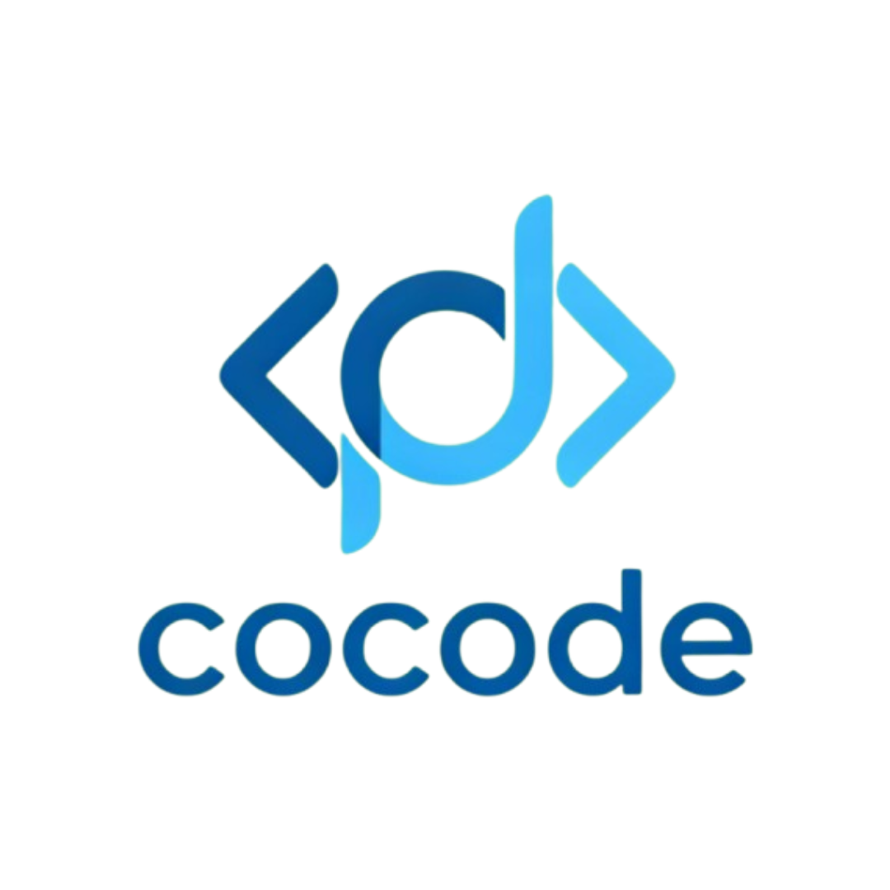

<p align="center">
  
</p>

# cocode 酷码工作室 — 开源与协作

欢迎加入 cocode 酷码工作室！我们是一个专注于 PHP 与全栈开发的开源协作团队，致力于分享实战经验、工具与项目模板，欢迎任何有热情的开发者参与贡献。

[](CONTRIBUTING.md) [](LICENSE)

## 亮点
- 开源协作：面向学习者与工程实践者的项目与示例
- 技术栈：PHP、Composer、MySQL、Redis、Docker
- 新手友好：包含详细贡献指南与模板，欢迎提出 issue 与 PR

## 快速开始（PHP 项目）

```bash
# 克隆仓库
git clone https://github.com/cocode-kumastudio/cocode.git
cd cocode

# 安装依赖（示例）
composer install

# 启动（若使用内置 PHP 服务器）
php -S localhost:8000 -t public
```

（具体项目以各子目录 README 为准）

## 如何加入
1. 通过 Issues 报告问题或提出功能请求
2. Fork 仓库并在新分支上开发（分支命名请使用 `feature/<描述>` 或 `fix/<描述>`）
3. 提交 Pull Request，项目维护者会进行代码审查

联系方式：xiaocao6466@163.com

## 贡献者守则
请阅读 [CODE_OF_CONDUCT.md](CODE_OF_CONDUCT.md) 以了解社区行为规范。

## 许可证
本项目使用 MIT 许可证，详情见 [LICENSE](LICENSE)。

## 常见问题（FAQ）
Q: 我可以用哪个编码风格？
A: 我们建议使用 PSR-12（PHP）作为代码风格。详见 CONTRIBUTING.md.
